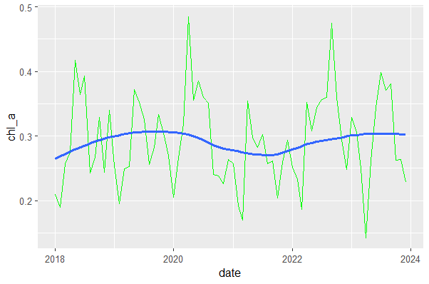
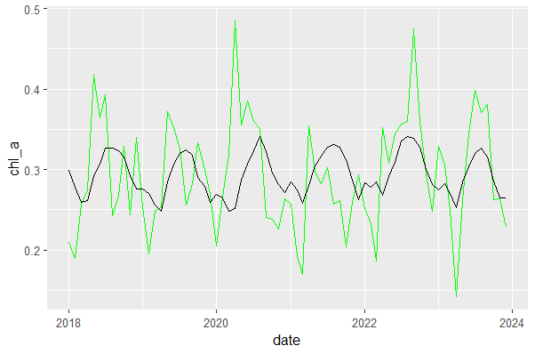
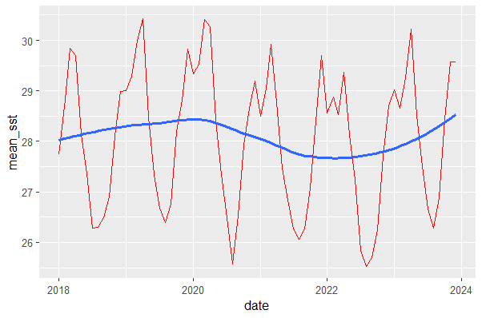
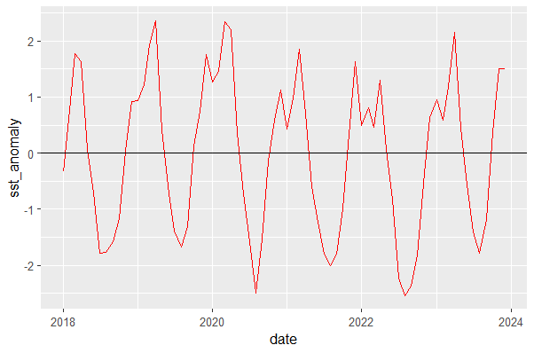
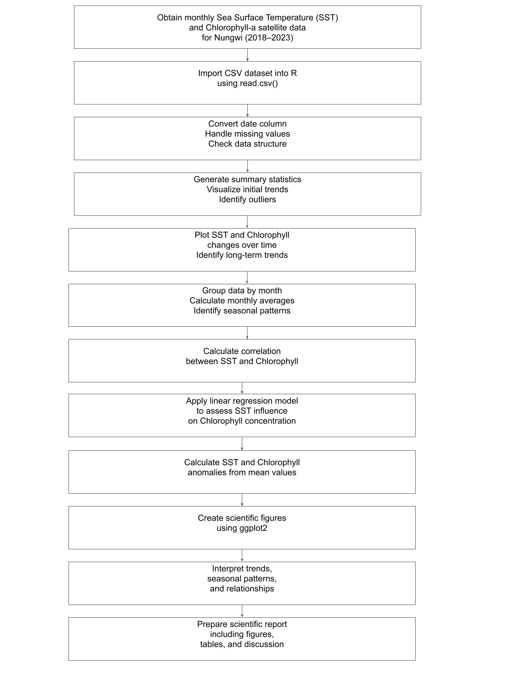
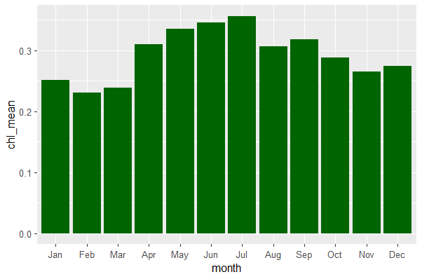
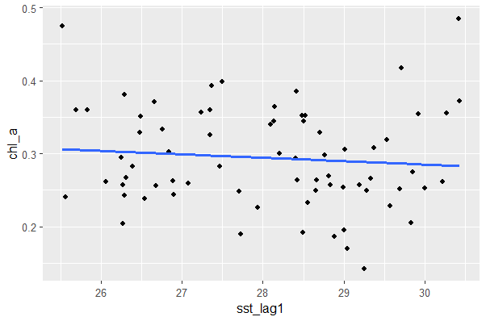
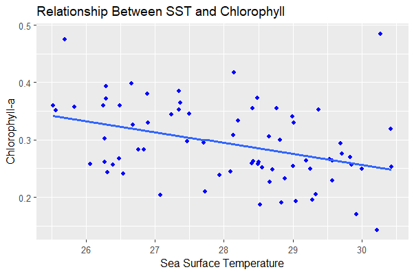

# SST and Chlorophyll Analysis

## Project Title
Relationship Between Sea Surface Temperature (SST) and Chlorophyll-a Concentration

## Overview
This project explores the relationship between sea surface temperature (SST) and chlorophyll-a concentration to understand marine productivity patterns.

The analysis focuses on time series environmental data and spatial interpretation of oceanographic conditions.

## Objectives
- Examine the relationship between SST and chlorophyll-a concentration
- Identify patterns in marine productivity
- Visualize temporal and spatial environmental trends

## Methods
- Time series analysis using R
- Statistical modeling
- Data visualization using ggplot2
- Spatial interpretation using GIS

## Tools Used
- **R Programming** (ggplot2, dplyr)
- **ArcGIS**
- **Time Series Analysis**
- **Spatial Data Analysis**
- **R Markdown**

  ## Project Structure

- data/ → SST-Chlorophyll dataset
- scripts/ → R Markdown analysis
- figures/ → Generated graphs
- maps/ → GIS study area maps
- report/ → Final project report

 ## Figures

Below are selected figures generated during the analysis:

## Outputs
- Time series visualizations
- Correlation analysis figures
- Final analytical report

## Author

Marine Data Analyst
R Programming | GIS (ArcGIS) | Marine Science | Environmental Data Analysis
